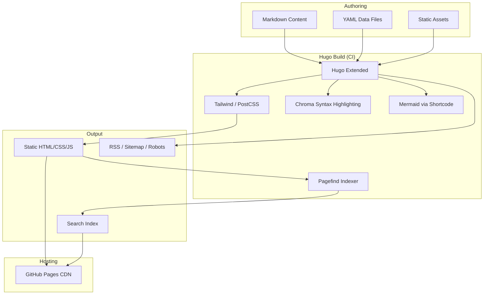

# Cyber Ember — Phase 1 Architecture Blueprint

> **Author:** Rithesh Chandra Alakati  
> **Stack:** Hugo Extended · Tailwind CSS · GitHub Pages  
> **Status:** Awaiting approval before Phase 2 implementation

---

## Table of Contents

1. [Executive Summary](#1-executive-summary)
2. [Architecture Blueprint](#2-architecture-blueprint)
3. [Folder Structure](#3-folder-structure)
4. [Content Model](#4-content-model)
5. [Taxonomy Strategy](#5-taxonomy-strategy)
6. [Design System](#6-design-system)
7. [Search System Recommendation](#7-search-system-recommendation)
8. [Comments System Recommendation](#8-comments-system-recommendation)
9. [SEO Strategy](#9-seo-strategy)
10. [Deployment Strategy](#10-deployment-strategy)
11. [Phase 2 Deliverables Checklist](#11-phase-2-deliverables-checklist)

---

## 1. Executive Summary

**Cyber Ember** is a custom Hugo theme and content architecture designed for a 5+ year cybersecurity portfolio. It prioritizes:

| Pillar | Approach |
|--------|----------|
| **Scalability** | Section-based content hierarchy; data-driven UI components; build-time search indexing |
| **Maintainability** | Strict front matter schemas, archetypes, single design-token source |
| **Performance** | Static output, minimal JS, lazy images, Pagefind WASM search, no runtime CMS |
| **Professionalism** | Dark-first premium UI inspired by HackerOne / HTB Academy / PortSwigger |
| **SEO** | Structured data, OpenGraph, sitemap, RSS, semantic HTML, canonical URLs |

**Key architectural decisions:**

- **Hugo Extended** (required for PostCSS/Tailwind pipeline and image processing)
- **Custom internal theme** `themes/cyber-ember/` (not a third-party theme — full control over branding)
- **Markdown-only content** in `content/` with YAML front matter
- **Data files** in `data/` for skills, timeline, stats, and site config (DRY, no hardcoding in templates)
- **Pagefind** for search (build-time index, scales to 1000+ pages)
- **Giscus** for comments (GitHub-native, privacy-respecting, fits security audience)
- **GitHub Actions** CI/CD → GitHub Pages

---

## 2. Architecture Blueprint

### 2.1 System Overview



### 2.2 Hugo Configuration Strategy

| Setting | Value | Rationale |
|---------|-------|-----------|
| `theme` | `cyber-ember` | Custom theme, versioned in-repo |
| `enableRobotsTXT` | `true` | Auto robots.txt |
| `pygmentsUseClasses` | `true` | Chroma classes for custom syntax theme |
| `pygmentsCodeFences` | `true` | Fenced code blocks |
| `pygmentsCodefencesGuessSyntax` | `true` | Auto-detect language |
| `enableGitInfo` | `true` (CI) | Last-modified dates from git |
| `paginate` | `12` | List pages (writeups, blog, notes) |
| `rssLimit` | `20` | RSS feed size |
| `buildDrafts` | `false` (prod) | Production builds exclude drafts |
| `canonifyURLs` | `true` | Absolute URLs for SEO |
| `pluralizeListTitles` | `false` | Clean list titles |

### 2.3 Template Hierarchy

```
layouts/
├── baseof.html              # Master shell (nav, footer, SEO head)
├── home.html                # Homepage (hero, featured, stats, terminal)
├── list.html                # Default section list
├── single.html              # Default single page
├── 404.html
├── writeups/
│   ├── list.html            # Writeup hub + platform filter
│   └── single.html          # Writeup detail + TOC + related
├── projects/
│   ├── list.html
│   └── single.html
├── blog/
│   ├── list.html
│   └── single.html
├── notes/
│   ├── list.html
│   └── single.html
├── certifications/
│   └── list.html            # Certification grid (no singles needed)
├── about/
│   └── single.html
├── contact/
│   └── single.html
├── resume/
│   └── single.html
└── _default/
    ├── taxonomy.html        # Tag/category listing
    └── terms.html           # Taxonomy term index
```

### 2.4 Partial Components

| Partial | Responsibility |
|---------|----------------|
| `head.html` | Meta, SEO, OG, Twitter, canonical, JSON-LD |
| `header.html` | Sticky navbar, search trigger, theme toggle |
| `footer.html` | Links, newsletter, RSS, social |
| `hero.html` | Homepage hero section |
| `terminal.html` | Interactive CLI widget |
| `stats-dashboard.html` | Animated counters |
| `skills-matrix.html` | Skill proficiency grid |
| `learning-timeline.html` | Chronological milestones |
| `writeup-card.html` | Reusable writeup card |
| `project-card.html` | Reusable project card |
| `article-card.html` | Blog/note card |
| `certification-card.html` | Certification badge card |
| `author-box.html` | Post author bio |
| `related-posts.html` | Related content by tags |
| `toc.html` | Table of contents |
| `breadcrumbs.html` | Breadcrumb nav + schema |
| `search-modal.html` | Pagefind search UI |
| `giscus.html` | Comments embed |
| `pagination.html` | List pagination |
| `schema/` | JSON-LD fragments (article, breadcrumb, person, website) |

### 2.5 Shortcodes

| Shortcode | Purpose |
|-----------|---------|
| `admonition` | Note, tip, warning, danger callouts |
| `mermaid` | Diagram rendering (client-side mermaid.js) |
| `terminal` | Inline terminal output blocks |
| `figure` | Responsive images with caption |
| `button` | CTA buttons (resume, GitHub, etc.) |
| `skill-bar` | Inline skill proficiency bar |
| `stats` | Inline stat counter |
| `details` | Collapsible sections (spoiler-free writeups) |

### 2.6 JavaScript Architecture (Minimal)

Only load JS where interaction is required:

| Module | Size Budget | Purpose |
|--------|-------------|---------|
| `theme.js` | ~2 KB | Dark/light toggle, localStorage |
| `terminal.js` | ~4 KB | Interactive CLI on homepage |
| `stats.js` | ~2 KB | Counter animations (Intersection Observer) |
| `nav.js` | ~2 KB | Mobile menu, sticky header |
| `mermaid.js` | lazy | Load only on pages with diagrams |
| `pagefind.js` | ~50 KB | Search (loaded on search open) |
| `giscus.js` | external | Loaded only on post pages |

**Total critical JS:** < 15 KB (excluding Pagefind/Giscus lazy loads)

### 2.7 Data-Driven Components

Static UI elements that change infrequently live in `data/` — not in templates:

```
data/
├── site.yaml           # Name, title, tagline, social links, email
├── skills.yaml         # Skills matrix with proficiency levels
├── timeline.yaml       # Learning timeline events
├── stats.yaml          # Manual stat overrides (auto-counted where possible)
├── certifications.yaml # Certification registry (also content/certifications/)
├── navigation.yaml     # Nav order and external links
└── terminal.yaml       # Terminal command responses
```

Hugo templates merge **auto-computed counts** (`.Site.RegularPages`, section counts) with **manual overrides** from `data/stats.yaml`.

---

## 3. Folder Structure

```
Pirtfolio/                              # Repository root
├── .github/
│   └── workflows/
│       └── deploy.yml                # Hugo build + Pagefind + GitHub Pages
├── archetypes/
│   ├── default.md
│   ├── writeup.md
│   ├── project.md
│   ├── blog.md
│   ├── note.md
│   └── certification.md
├── assets/
│   ├── css/
│   │   └── main.css                  # Tailwind entry (@tailwind directives)
│   └── js/
│       ├── main.js                   # Bundle entry
│       ├── theme.js
│       ├── terminal.js
│       ├── stats.js
│       └── nav.js
├── content/
│   ├── _index.md                     # Homepage content (hero text, intro)
│   ├── about/
│   │   └── _index.md
│   ├── projects/
│   │   ├── _index.md
│   │   └── _index.md                 # Section landing
│   │   └── *.md                      # Individual projects
│   ├── writeups/
│   │   ├── _index.md                 # Writeups hub
│   │   ├── hackthebox/
│   │   │   ├── _index.md
│   │   │   └── *.md
│   │   ├── tryhackme/
│   │   │   ├── _index.md
│   │   │   └── *.md
│   │   ├── vulnyx/
│   │   ├── hackmyvm/
│   │   ├── provinggrounds/
│   │   └── ctf/
│   ├── blog/
│   │   ├── _index.md
│   │   └── *.md
│   ├── notes/
│   │   ├── _index.md
│   │   ├── linux/
│   │   ├── networking/
│   │   ├── web-security/
│   │   ├── active-directory/
│   │   ├── privilege-escalation/
│   │   ├── bash/
│   │   ├── python/
│   │   └── api-security/
│   ├── certifications/
│   │   └── _index.md                 # All certs on one page (or individual .md)
│   ├── resume/
│   │   └── _index.md
│   └── contact/
│       └── _index.md
├── data/
│   ├── site.yaml
│   ├── skills.yaml
│   ├── timeline.yaml
│   ├── stats.yaml
│   ├── navigation.yaml
│   └── terminal.yaml
├── docs/
│   └── PHASE-1-ARCHITECTURE.md       # This document
├── layouts/                          # Root layout overrides (minimal)
│   └── (only if needed beyond theme)
├── static/
│   ├── images/
│   │   ├── profile/
│   │   ├── writeups/
│   │   ├── projects/
│   │   └── og/                       # OpenGraph default images
│   ├── files/
│   │   └── resume.pdf
│   ├── favicon.ico
│   ├── favicon.svg
│   └── robots.txt                    # Optional override
├── themes/
│   └── cyber-ember/
│       ├── assets/
│       │   ├── css/
│       │   │   ├── main.css
│       │   │   └── chroma.css        # Syntax highlighting theme
│       │   └── js/
│       ├── layouts/
│       │   ├── _default/
│       │   ├── partials/
│       │   ├── shortcodes/
│       │   └── (section layouts)
│       ├── static/
│       ├── archetypes/               # Theme-level archetype defaults
│       ├── theme.toml
│       └── README.md
├── config/
│   ├── _default/
│   │   ├── hugo.toml                 # Main config
│   │   ├── params.toml               # Theme params
│   │   ├── menus.toml                # Navigation menus
│   │   └── markup.toml               # Goldmark, highlight, TOC
│   └── production/
│       └── hugo.toml                 # Production overrides (baseURL, analytics)
├── package.json                      # Tailwind, PostCSS, Pagefind
├── postcss.config.js
├── tailwind.config.js
├── .gitignore
├── README.md
└── LICENSE
```

### 3.1 Scaling Projections

| Content Type | Year 1 | Year 3 | Year 5 |
|--------------|--------|--------|--------|
| Writeups | 20–40 | 80–150 | 200–400 |
| Blog posts | 10–20 | 40–80 | 100+ |
| Notes | 15–30 | 60–120 | 200+ |
| Projects | 5–10 | 15–25 | 30+ |

Architecture supports **1000+ pages** without structural changes. Only Pagefind index size grows (~linear, still fast).

---

## 4. Content Model

### 4.1 Global Front Matter Fields

Used across all content types:

```yaml
---
title: "Page Title"
date: 2025-06-08
lastmod: 2025-06-08          # Auto from git in CI
draft: false
description: "SEO meta description (150–160 chars)"
summary: "Card/list excerpt"
featured_image: "/images/og/default.png"
author: "Rithesh Chandra Alakati"
tags: []
categories: []
---
```

### 4.2 Writeup Schema

**Path:** `content/writeups/{platform}/{slug}.md`

```yaml
---
title: "Lame"
date: 2025-03-15
description: "HTB Lame writeup — Samba usermap_script exploit"
summary: "Easy Linux machine exploiting CVE-2007-2447"
platform: "hackthebox"        # Param (also inferred from section path)
difficulty: "easy"            # easy | medium | hard | insane
os: "Linux"                   # Linux | Windows | Other
points: 20
status: "retired"             # active | retired
featured: true
featured_image: "/images/writeups/htb-lame.png"
tags: ["smb", "metasploit", "linux"]
skills: ["nmap", "metasploit", "linux"]
reading_time: true            # Auto-computed by Hugo (disable to override)
aliases: ["/writeups/htb-lame"]  # Optional URL redirects
---
```

**Writeup card renders:** title, platform badge, difficulty chip, tags, reading time, date, featured image.

### 4.3 Project Schema

**Path:** `content/projects/{slug}.md`

```yaml
---
title: "Network Scanner CLI"
date: 2025-01-10
description: "Custom Python network reconnaissance tool"
summary: "Async port scanner with service detection"
featured: true
featured_image: "/images/projects/network-scanner.png"
technologies: ["Python", "asyncio", "scapy"]
github: "https://github.com/username/repo"
demo: ""                      # Optional live demo URL
status: "completed"           # in-progress | completed | archived
features:
  - "Async TCP/UDP scanning"
  - "Service version detection"
  - "JSON/CSV export"
skills_demonstrated: ["python", "networking", "nmap"]
tags: ["python", "tool-development"]
categories: ["projects"]
---
```

### 4.4 Blog Schema

**Path:** `content/blog/{slug}.md`

```yaml
---
title: "Understanding Kerberoasting"
date: 2025-05-20
description: "Deep dive into Kerberoasting attacks in Active Directory"
summary: "How TGS tickets are abused for offline cracking"
categories: ["active-directory"]   # Primary category
tags: ["kerberos", "active-directory", "privilege-escalation"]
featured: false
featured_image: "/images/blog/kerberoasting.png"
series: "AD Attack Series"         # Optional
series_order: 1
comments: true
---
```

**Blog categories (controlled vocabulary):**
`web-security`, `linux`, `networking`, `active-directory`, `privilege-escalation`, `malware-analysis`, `bash-scripting`, `programming`, `research`, `career-notes`

### 4.5 Note Schema

**Path:** `content/notes/{topic}/{slug}.md`

```yaml
---
title: "Linux File Permissions Cheat Sheet"
date: 2025-04-01
description: "Quick reference for Linux permission bits and special flags"
summary: "chmod, chown, SUID, SGID, sticky bit"
topic: "linux"                # Inferred from section
note_type: "cheatsheet"       # cheatsheet | reference | procedure | concept
tags: ["linux", "permissions"]
difficulty: "beginner"        # beginner | intermediate | advanced
---
```

### 4.6 Certification Schema

**Path:** `content/certifications/` (individual entries or single `_index.md` with data file)

**Option A — Data-driven (recommended for grid display):**

`data/certifications.yaml`:
```yaml
certifications:
  - name: "CompTIA Security+"
    issuer: "CompTIA"
    date: "2024-08"
    credential_url: "https://..."
    credential_id: "XXXXX"
    skills: ["network-security", "cryptography", "risk-management"]
    logo: "/images/certs/security-plus.png"
    status: "active"          # active | expired | in-progress
```

**Option B — Markdown per cert** (better for long cert study notes):
```yaml
---
title: "OSCP"
date: 2025-06-01
issuer: "Offensive Security"
credential_url: "https://..."
skills: ["penetration-testing", "buffer-overflow", "active-directory"]
status: "in-progress"
---
```

**Recommendation:** Use **data file for homepage/about display** + optional **markdown pages** for detailed certification journey writeups.

### 4.7 About / Contact / Resume

These are **single pages** (`_index.md`) with structured front matter:

```yaml
# content/about/_index.md
---
title: "About"
type: "about"                 # Custom layout selector
education:
  - institution: "University Name"
    degree: "B.S. Cybersecurity"
    period: "2022–2026"
career_goals: "..."
---
```

```yaml
# content/contact/_index.md
---
title: "Contact"
type: "contact"
email: "rithesh@example.com"
github: "https://github.com/username"
linkedin: "https://linkedin.com/in/username"
form_enabled: true
form_action: "https://formspree.io/f/xxxxx"   # Or Formspark/Getform
---
```

### 4.8 Homepage (`content/_index.md`)

```yaml
---
title: "Home"
---
Hero content, intro paragraph, and CTA text live here as Markdown body.
Featured sections are **template-driven** (query `featured: true` pages).
```

---

## 5. Taxonomy Strategy

### 5.1 Hugo Taxonomies

```toml
# config/_default/hugo.toml
[taxonomies]
  tag = "tags"
  category = "categories"
  skill = "skills"
  platform = "platforms"
```

| Taxonomy | Purpose | Example Terms |
|----------|---------|---------------|
| `tags` | Granular, cross-cutting topics | `nmap`, `burp-suite`, `suid`, `kerberoasting` |
| `categories` | Broad content classification | `web-security`, `linux`, `writeups` |
| `skills` | Skill-based filtering | `python`, `active-directory`, `osint` |
| `platforms` | Lab/CTF platform filter | `hackthebox`, `tryhackme`, `ctf` |

### 5.2 Section vs Taxonomy Decision Matrix

| Dimension | Implementation | Why |
|-----------|----------------|-----|
| **Writeup platform** | **Section path** (`writeups/hackthebox/`) | Natural URL hierarchy, breadcrumbs, scalable |
| **Writeup difficulty** | **Front matter param** + `.Site.Taxonomies` filter pages | Faceted filter, not a URL segment |
| **Blog category** | **Taxonomy** `categories` | Standard blog pattern, category archive pages |
| **Notes topic** | **Section path** (`notes/linux/`) | Mirrors folder organization |
| **Tags** | **Taxonomy** `tags` | Cross-content discovery |
| **Skills** | **Taxonomy** `skills` | Skills matrix ↔ content linking |

### 5.3 URL Structure

```
/                                           # Home
/about/                                     # About
/writeups/                                  # Writeups hub
/writeups/hackthebox/lame/                  # Individual writeup
/writeups/tryhackme/                        # Platform listing
/projects/network-scanner-cli/              # Project
/blog/understanding-kerberoasting/          # Blog post
/blog/categories/active-directory/          # Category archive
/notes/linux/file-permissions/              # Note
/certifications/                            # Certifications
/resume/                                    # Resume page
/contact/                                   # Contact
/tags/nmap/                                 # Tag archive
/search/                                    # Search page (Pagefind UI)
```

### 5.4 Related Posts Algorithm

```
1. Same section + shared tags (weight: 3)
2. Shared skills taxonomy (weight: 2)
3. Same category (weight: 1)
→ Return top 4 by score, exclude current page
```

Implemented in `partials/related-posts.html` using Hugo template logic (no JS).

---

## 6. Design System

### 6.1 Design Tokens (CSS Custom Properties)

```css
:root {
  /* Backgrounds */
  --color-bg-primary:    #0B0F19;
  --color-bg-secondary:  #111827;
  --color-bg-card:       #1F2937;
  --color-bg-glass:      rgba(31, 41, 55, 0.6);

  /* Accents */
  --color-accent-primary:   #FF6B00;
  --color-accent-secondary: #FF8C00;
  --color-accent-highlight: #FFA726;
  --color-accent-soft:      #FFB74D;

  /* Text */
  --color-text-primary:   #FFFFFF;
  --color-text-secondary: #CBD5E1;
  --color-text-muted:     #94A3B8;

  /* Borders & States */
  --color-border:  #374151;
  --color-danger:  #EF4444;
  --color-success: #FF8C00;

  /* Gradients */
  --gradient-primary: linear-gradient(135deg, #FF6B00, #FF8C00);
  --gradient-warm:    linear-gradient(135deg, #FF8C00, #FFA726);
  --gradient-soft:    linear-gradient(135deg, #FF6B00, #FFB74D);

  /* Glow */
  --glow-accent: 0 0 20px rgba(255, 107, 0, 0.3);
  --glow-subtle: 0 0 40px rgba(255, 107, 0, 0.1);

  /* Typography */
  --font-sans:  'Inter', system-ui, sans-serif;
  --font-mono:  'JetBrains Mono', 'Fira Code', monospace;
  --font-display: 'Inter', system-ui, sans-serif;

  /* Spacing Scale (4px base) */
  --space-1: 0.25rem;
  --space-2: 0.5rem;
  --space-3: 0.75rem;
  --space-4: 1rem;
  --space-6: 1.5rem;
  --space-8: 2rem;
  --space-12: 3rem;
  --space-16: 4rem;

  /* Radius */
  --radius-sm: 0.375rem;
  --radius-md: 0.5rem;
  --radius-lg: 0.75rem;
  --radius-xl: 1rem;

  /* Shadows */
  --shadow-card: 0 4px 6px -1px rgba(0, 0, 0, 0.3);
  --shadow-elevated: 0 10px 25px -5px rgba(0, 0, 0, 0.4);

  /* Transitions */
  --transition-fast: 150ms ease;
  --transition-base: 250ms ease;
  --transition-slow: 400ms ease;
}
```

### 6.2 Light Mode Override

Light mode is **secondary** (toggle available), optimized for recruiters printing resume:

```css
[data-theme="light"] {
  --color-bg-primary:    #F8FAFC;
  --color-bg-secondary:  #F1F5F9;
  --color-bg-card:       #FFFFFF;
  --color-text-primary:   #0F172A;
  --color-text-secondary: #475569;
  --color-border:         #E2E8F0;
}
```

### 6.3 Typography Scale

| Element | Font | Size | Weight | Line Height |
|---------|------|------|--------|-------------|
| H1 (Hero) | Inter | 3rem / 48px | 700 | 1.1 |
| H1 (Page) | Inter | 2.25rem / 36px | 700 | 1.2 |
| H2 | Inter | 1.75rem / 28px | 600 | 1.3 |
| H3 | Inter | 1.375rem / 22px | 600 | 1.4 |
| Body | Inter | 1rem / 16px | 400 | 1.7 |
| Small | Inter | 0.875rem / 14px | 400 | 1.5 |
| Code | JetBrains Mono | 0.875rem | 400 | 1.6 |
| Terminal | JetBrains Mono | 0.875rem | 400 | 1.5 |

### 6.4 Component Library

| Component | Description |
|-----------|-------------|
| **Card** | Glassmorphism bg, border `#374151`, hover glow, rounded-xl |
| **Badge** | Platform/difficulty chips — color-coded by difficulty |
| **Button Primary** | Gradient bg, animated shimmer on hover |
| **Button Ghost** | Border only, accent on hover |
| **Navbar** | Sticky, blur backdrop, border-bottom on scroll |
| **Terminal** | Monospace, fake window chrome (●●●), typing animation |
| **Skill Bar** | Horizontal bar with accent gradient fill |
| **Stat Counter** | Large number, accent color, label below |
| **Timeline** | Vertical line, accent dots, card events |
| **Admonition** | Left border accent, icon, title, body |
| **TOC** | Sticky sidebar, active section highlight |
| **Search Modal** | Fullscreen overlay, glassmorphism, keyboard nav |

### 6.5 Difficulty Color Mapping

| Difficulty | Color | Badge Style |
|------------|-------|-------------|
| Easy | `#22C55E` (muted green — not neon) | Subtle, professional |
| Medium | `#FF8C00` | Accent secondary |
| Hard | `#EF4444` | Danger red |
| Insane | `#A855F7` | Purple (rare, distinctive) |

### 6.6 Responsive Breakpoints (Tailwind)

```
sm:  640px   — Mobile landscape
md:  768px   — Tablet
lg:  1024px  — Desktop
xl:  1280px  — Wide desktop
2xl: 1536px  — Ultra-wide
```

**Mobile-first:** Single column → 2-col cards at `md` → 3-col at `lg`.

### 6.7 Accessibility (WCAG 2.1 AA)

- Color contrast: `#CBD5E1` on `#0B0F19` = **12.4:1** ✓
- Accent `#FF6B00` on `#0B0F19` = **5.8:1** ✓ (large text / UI)
- Focus rings: 2px accent outline on all interactive elements
- Skip-to-content link
- Semantic HTML5 landmarks (`<header>`, `<nav>`, `<main>`, `<article>`, `<footer>`)
- `aria-label` on icon-only buttons
- Reduced motion: `@media (prefers-reduced-motion: reduce)` disables animations
- Keyboard-navigable search modal

---

## 7. Search System Recommendation

### 7.1 Comparison Matrix

| Criteria | Pagefind | Lunr.js | Fuse.js |
|----------|----------|---------|---------|
| **Indexing** | Build-time (post-Hugo) | Build-time JSON | Build-time JSON |
| **Runtime** | WASM (~50 KB) | JS (~25 KB) + full index | JS (~7 KB) + full index |
| **Index size at 500 pages** | ~2–4 MB (compressed, chunked) | ~5–15 MB JSON | ~5–15 MB JSON |
| **Full-text quality** | Excellent (stemming, TF-IDF) | Good | Fuzzy (typo-tolerant) |
| **Faceted filtering** | Native (`data-platform`, `data-difficulty`) | Manual | Manual |
| **Hugo integration** | Official docs, CLI tool | Custom template | Custom template |
| **GitHub Pages compat** | ✓ Static files | ✓ | ✓ |
| **Maintenance** | Active (CloudCannon) | Stale (last major 2019) | Active but generic |
| **Setup complexity** | Low (1 CLI command in CI) | Medium | Medium |
| **Offline/Privacy** | 100% client-side after load | 100% client-side | 100% client-side |

### 7.2 Recommendation: **Pagefind**

**Rationale:**

1. **Purpose-built for static sites** — indexes Hugo output directly, no custom JSON templates
2. **Scales efficiently** — chunked index loads only matching fragments (critical at 500+ pages)
3. **Faceted search** — filter writeups by `platform`, `difficulty`, `tags` via HTML `data-*` attributes
4. **Zero config Hugo integration** — `npx pagefind --site public` in CI after `hugo` build
5. **Superior search quality** — stemming, ranking, excerpt highlighting out of the box
6. **Lazy loadable** — search UI + WASM load only when user opens search modal

**Implementation plan:**

```yaml
# GitHub Actions step (Phase 2)
- run: hugo --minify --gc --environment production
- run: npx pagefind --site public --output-path public/pagefind
```

```html
<!-- Search modal with filters -->
<div id="search" data-pagefind-body>
  <!-- Platform filter buttons set data-pagefind-filter -->
</div>
```

**Fallback:** If Pagefind WASM is blocked (rare corporate environments), provide a `/search/` page with a simple pre-built JSON index via Fuse.js as progressive enhancement.

---

## 8. Comments System Recommendation

### 8.1 Comparison Matrix

| Criteria | Giscus | Utterances | Disqus |
|----------|--------|------------|--------|
| **Backend** | GitHub Discussions | GitHub Issues | Disqus servers |
| **Auth** | GitHub login | GitHub login | Disqus / social / guest |
| **Privacy** | Excellent | Excellent | Poor (tracking, ads) |
| **Moderation** | GitHub Discussions tools | GitHub Issues tools | Disqus dashboard |
| **UI customization** | Extensive (theme vars) | Limited | Moderate |
| **Reactions** | ✓ | ✗ | ✓ |
| **Nested replies** | ✓ | Limited | ✓ |
| **Ads** | None | None | Yes (free tier) |
| **GDPR** | Compliant | Compliant | Problematic |
| **Audience fit** | Developers, security pros | Developers | General |
| **Repo requirement** | Public repo + Discussions enabled | Public repo | None |
| **Performance** | Lightweight iframe | Lightweight iframe | Heavy (tracking scripts) |

### 8.2 Recommendation: **Giscus**

**Rationale:**

1. **Audience alignment** — recruiters, pentesters, and CTF players overwhelmingly have GitHub accounts
2. **Privacy-first** — no tracking, no ads, GDPR-compliant (critical for EU recruiters)
3. **Professional appearance** — fully themeable to match Cyber Ember dark palette
4. **Moderation** — GitHub Discussions moderation tools (lock, pin, mark answer)
5. **Reactions** — 👍 useful for writeup feedback without full comments
6. **Already requires public GitHub repo** for portfolio hosting — zero additional infra

**Configuration (Phase 2):**

```toml
# config/_default/params.toml
[comments]
  enabled = true
  provider = "giscus"
  repo = "username/Pirtfolio"
  repoId = "R_xxxx"           # From giscus.app setup
  category = "Comments"
  categoryId = "DIC_xxxx"
  mapping = "pathname"
  theme = "noborder_dark"
  lang = "en"
```

**Per-post control:** `comments: false` in front matter disables Giscus on specific pages (e.g., CTF writeups under embargo).

**Alternative for writeups:** Comments enabled on **blog** and **projects** only; writeups default to `comments: false` (avoid spoilers in comments).

---

## 9. SEO Strategy

### 9.1 Technical SEO

| Item | Implementation |
|------|----------------|
| **XML Sitemap** | Hugo built-in (`/sitemap.xml`) + custom `sitemap.xml` template for priority/changefreq |
| **Robots.txt** | Hugo `enableRobotsTXT` + reference sitemap |
| **Canonical URLs** | `<link rel="canonical">` in `head.html` via `.Permalink` |
| **RSS Feed** | Hugo built-in (`/index.xml`) linked in `<head>` and footer |
| **Meta description** | Front matter `description` → `<meta name="description">` |
| **OpenGraph** | `og:title`, `og:description`, `og:image`, `og:url`, `og:type` |
| **Twitter Cards** | `summary_large_image` with `twitter:card`, `twitter:image` |
| **hreflang** | Single language now; structure ready for `en` |
| **404 page** | Custom branded 404 with search + popular links |
| **Internal linking** | Related posts, breadcrumbs, tag links, series navigation |

### 9.2 Structured Data (JSON-LD)

| Schema | Pages | Key Fields |
|--------|-------|------------|
| `WebSite` | Home | `name`, `url`, `potentialAction` (SearchAction for Pagefind) |
| `Person` | Home, About | `name`, `jobTitle`, `sameAs` (GitHub, LinkedIn) |
| `Article` | Blog, Writeups | `headline`, `datePublished`, `author`, `image` |
| `TechArticle` | Notes | `proficiencyLevel`, `dependencies` |
| `BreadcrumbList` | All inner pages | Dynamic from section hierarchy |
| `ProfilePage` | About | `mainEntity` → Person |
| `CreativeWork` | Projects | `creator`, `programmingLanguage`, `codeRepository` |

### 9.3 Content SEO Guidelines (Documented for Author)

- **Title:** 50–60 chars, primary keyword first
- **Description:** 150–160 chars, include platform/difficulty for writeups
- **URLs:** Kebab-case, include platform prefix in writeup slugs where helpful
- **Images:** Descriptive `alt` text, WebP with fallback, max 1200px wide
- **Headings:** Single H1 per page, logical H2→H3 hierarchy
- **Internal links:** 2–3 per writeup to related notes/blog posts

### 9.4 Performance SEO (Core Web Vitals)

| Metric | Target | Strategy |
|--------|--------|----------|
| LCP | < 2.5s | Preload hero image, font `display: swap` |
| FID/INP | < 200ms | Minimal JS, defer non-critical |
| CLS | < 0.1 | Explicit image dimensions, font fallbacks |
| TTFB | < 600ms | GitHub Pages CDN (global) |

### 9.5 Social Sharing

- Default OG image: branded template with title overlay (generated or static)
- Per-post `featured_image` overrides default
- Writeup cards include platform logo watermark on OG images

---

## 10. Deployment Strategy

### 10.1 Hosting: GitHub Pages

**Recommended setup:** User/organization site OR project site

| Type | URL | `baseURL` |
|------|-----|-----------|
| User site | `https://ritheshalakati.github.io/` | `https://ritheshalakati.github.io/` |
| Project site | `https://ritheshalakati.github.io/Pirtfolio/` | `https://ritheshalakati.github.io/Pirtfolio/` |

> **Decision needed in Phase 2:** Confirm GitHub username and whether this is a user site or project site repo.

### 10.2 CI/CD Pipeline

```mermaid
flowchart LR
    PUSH[Push to main] --> GHA[GitHub Actions]
    GHA --> CHECKOUT[Checkout + Submodule]
    CHECKOUT --> NODE[Setup Node.js]
    NODE --> NPM[npm ci]
    NPM --> HUGO[Setup Hugo Extended]
    HUGO --> BUILD[hugo --minify --gc]
    BUILD --> PF[npx pagefind --site public]
    PF --> DEPLOY[Deploy to GitHub Pages]
    DEPLOY --> LIVE[Live Site]
```



### 10.3 GitHub Actions Workflow (Outline)

```yaml
name: Deploy Hugo Site to GitHub Pages

on:
  push:
    branches: [main]
  workflow_dispatch:

permissions:
  contents: read
  pages: write
  id-token: write

concurrency:
  group: pages
  cancel-in-progress: true

jobs:
  build:
    runs-on: ubuntu-latest
    steps:
      - uses: actions/checkout@v4
        with:
          fetch-depth: 0          # Git info for lastmod
      - uses: actions/setup-node@v4
        with:
          node-version: 22
          cache: npm
      - run: npm ci
      - uses: peaceiris/actions-hugo@v3
        with:
          hugo-version: '0.146.0'
          extended: true
      - run: hugo --minify --gc --environment production
      - run: npx pagefind --site public
      - uses: actions/upload-pages-artifact@v3
        with:
          path: public

  deploy:
    needs: build
    runs-on: ubuntu-latest
    environment:
      name: github-pages
      url: ${{ steps.deployment.outputs.page_url }}
    steps:
      - uses: actions/deploy-pages@v4
        id: deployment
```

### 10.4 Repository Settings

1. **Settings → Pages → Source:** GitHub Actions
2. **Settings → General → Environments:** `github-pages` environment
3. **Repo → Settings → Discussions:** Enable (for Giscus)
4. **Branch protection:** `main` — require CI pass before merge (optional, recommended)

### 10.5 Local Development

```bash
# Prerequisites
# - Hugo Extended >= 0.120
# - Node.js >= 20

npm install
hugo server -D --disableFastRender   # Hot reload dev server
```

### 10.6 Custom Domain (Optional, Future)

- Add `CNAME` file in `static/` (e.g., `ritheshalakati.dev`)
- Configure DNS A/CNAME records
- Enable HTTPS (automatic via GitHub Pages)
- Update `baseURL` in `config/production/hugo.toml`

### 10.7 Environment Separation

| Environment | Config | baseURL | buildDrafts |
|-------------|--------|---------|-------------|
| Development | `hugo server -D` | `http://localhost:1313/` | `true` |
| Production | `--environment production` | GitHub Pages URL | `false` |

### 10.8 Security Headers (GitHub Pages Limitation)

GitHub Pages does not support custom HTTP headers natively. Mitigations:

- No user-generated content (static site — low risk)
- Contact form via **Formspree/Formspark** (no server-side code)
- `rel="noopener noreferrer"` on all external links
- Subresource Integrity (SRI) on CDN scripts (Mermaid)
- Content Security Policy via `<meta>` tag (best-effort)

---

## 11. Phase 2 Deliverables Checklist

Upon your approval, Phase 2 will implement:

### Infrastructure
- [ ] Initialize Hugo site with Extended support
- [ ] `package.json` with Tailwind CSS 4, PostCSS, Pagefind
- [ ] `tailwind.config.js` with Cyber Ember design tokens
- [ ] `config/_default/` (hugo.toml, params.toml, menus.toml, markup.toml)
- [ ] `.gitignore`, `README.md`, `LICENSE`

### Theme: `cyber-ember`
- [ ] `theme.toml` metadata
- [ ] `baseof.html`, all layout templates
- [ ] All partials (nav, footer, hero, terminal, stats, skills, timeline, cards, SEO, search, giscus)
- [ ] All shortcodes (admonition, mermaid, terminal, figure, button, details)
- [ ] `main.css` — full Tailwind component layer
- [ ] `chroma.css` — orange-tinted syntax theme
- [ ] JavaScript modules (theme, terminal, stats, nav)

### Content Scaffolding
- [ ] All archetypes with documented front matter
- [ ] Sample content for every section (1–2 examples each)
- [ ] `data/` files populated with your brand info
- [ ] Placeholder images and resume PDF path

### Features
- [ ] Interactive terminal (whoami, skills, projects, certifications, contact, help)
- [ ] Statistics dashboard with animated counters
- [ ] Skills matrix component
- [ ] Learning timeline component
- [ ] Pagefind search modal with platform/difficulty filters
- [ ] Giscus comments integration
- [ ] Reading time, related posts, author box, TOC
- [ ] RSS feed
- [ ] Mermaid diagram support
- [ ] Admonition shortcodes

### SEO
- [ ] JSON-LD structured data (Person, WebSite, Article, Breadcrumb)
- [ ] OpenGraph + Twitter Cards
- [ ] Custom sitemap template
- [ ] Canonical URLs, meta tags

### Deployment
- [ ] GitHub Actions workflow (`.github/workflows/deploy.yml`)
- [ ] Production config with correct baseURL placeholder

---

## Decisions Required Before Phase 2

Please confirm or provide:

| # | Decision | Default Assumption |
|---|----------|-------------------|
| 1 | **GitHub username** | `ritheshalakati` |
| 2 | **Site type** | Project site (`/Pirtfolio/`) |
| 3 | **Email address** | Placeholder until provided |
| 4 | **Profile image** | Placeholder SVG avatar |
| 5 | **Contact form provider** | Formspree (free tier) |
| 6 | **Custom domain** | None initially |
| 7 | **Comments on writeups** | Disabled by default (spoiler prevention) |
| 8 | **Certifications data** | Provide your cert list, or use placeholders |
| 9 | **Giscus repo** | Same repo (`Pirtfolio`) with Discussions enabled |

---

**Reply with "approved" (and any corrections to the decisions above) to proceed to Phase 2 implementation.**
